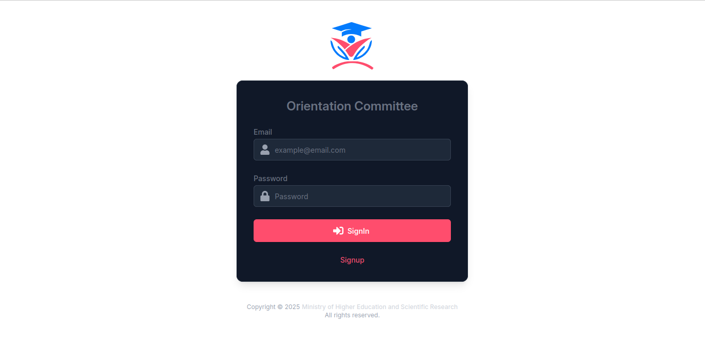
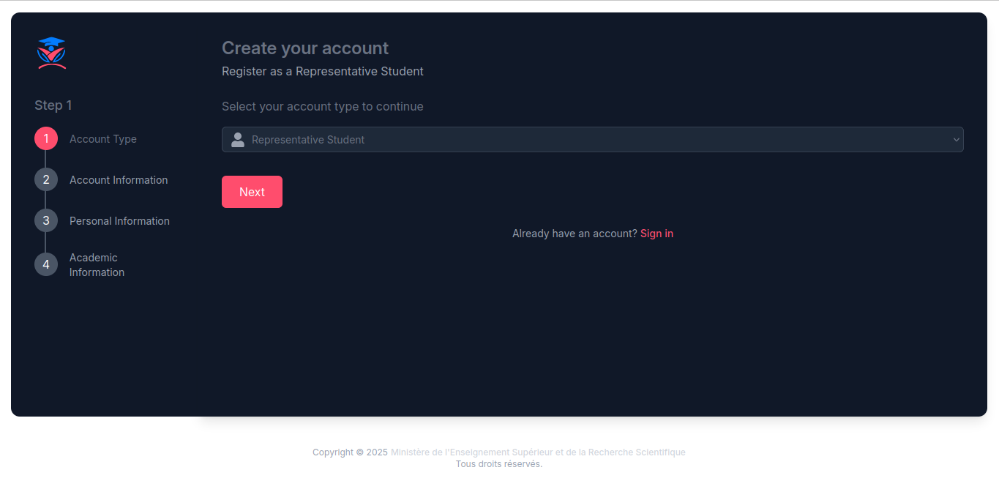
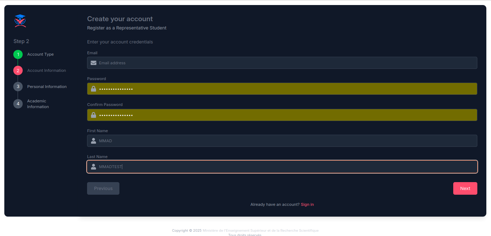
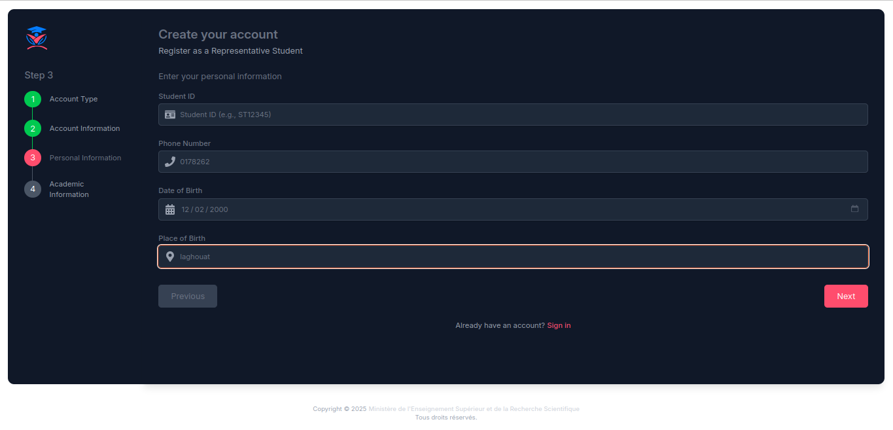
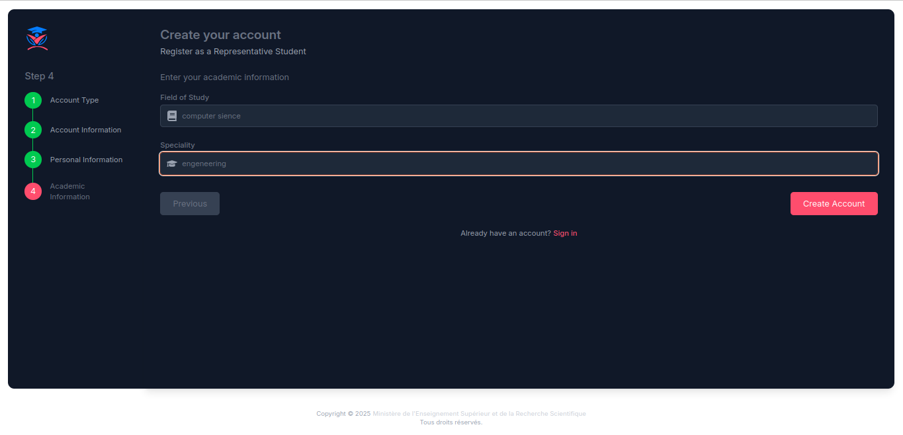
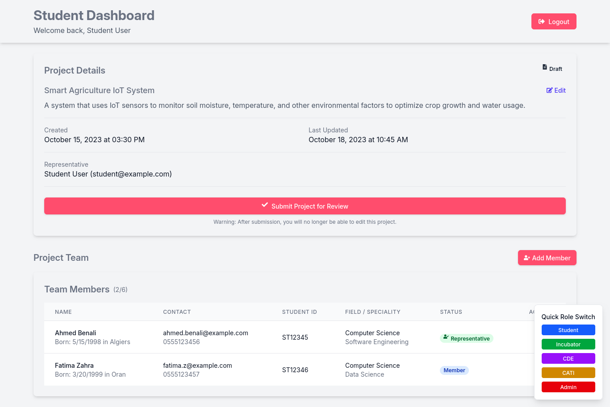
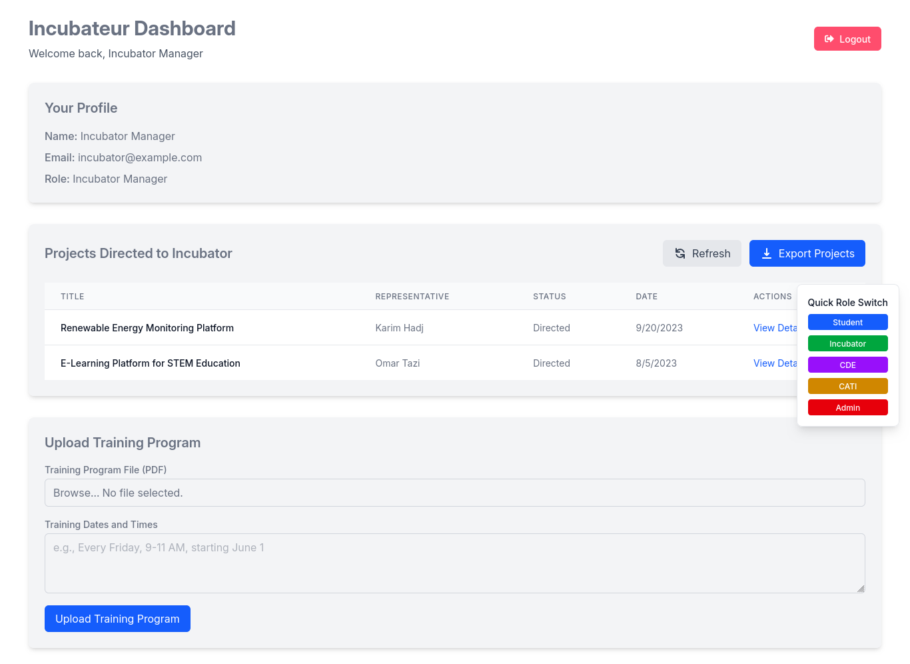
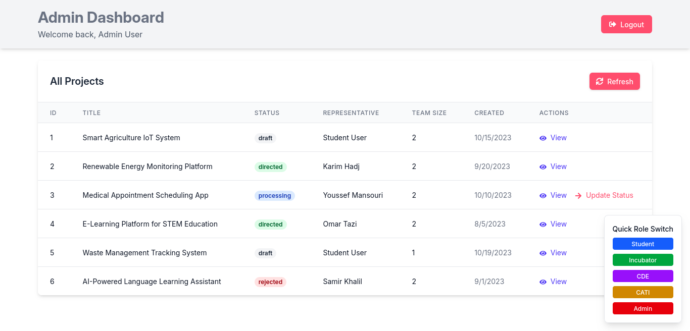

# Algeria Orientation Committee Platform

A web application for managing student projects, facilitating collaboration between students, incubators, and technical centers.

## Table of Contents

- [Overview](#overview)
- [Features](#features)
- [Screenshots](#screenshots)
- [Technologies Used](#technologies-used)
- [Installation](#installation)
- [Usage](#usage)
- [Project Structure](#project-structure)
- [Contributing](#contributing)
- [License](#license)

## Overview

The Algeria Orientation Committee Platform is designed to streamline the process of student project submissions, reviews, and collaborations with various technical centers and incubators. It provides role-specific dashboards for students, incubator managers, CDE (Center for Digital Excellence) managers, CATI (Center for Advanced Technology and Innovation) managers, and administrators.

## Features

- **User Authentication**: Role-based access control with five distinct roles
- **Project Management**: Create, view, update, and submit projects
- **Team Management**: Add and manage team members for projects
- **Project Review Workflow**: Submit projects for review and track their status
- **Training Program Management**: Upload training programs and set dates
- **Export Functionality**: Export project data to Excel format
- **Role Switching**: Easily switch between different roles for testing and demonstration

## Screenshots

### Sign In Page

*The sign-in page allows users to authenticate with their credentials and includes quick access buttons for demonstration purposes.*

### Account Setup

*Users can select their account type during the registration process.*


*Form for entering basic account information during registration.*


*Users can provide their personal information for a complete profile.*


*Students can enter their academic details including field of study and specialization.*

### Home Page

*The home page provides quick access to all dashboards and includes a dropdown menu for navigating to any route in the application.*

### Student Dashboard

*Students can create and manage projects, add team members, and submit projects for review. The dashboard provides a comprehensive overview of project status.*

### Incubator Dashboard

*Incubator managers can view projects directed to them, export project data, and upload training programs. They can also provide feedback on student projects.*

### Admin Dashboard

*Administrators have an overview of all projects and can update project statuses and direct them to appropriate interfaces. The admin dashboard provides tools for managing the entire platform.*

## Technologies Used

- **Frontend**:
  - React
  - TypeScript
  - Tailwind CSS
  - React Router
  - Zustand (State Management)
  - React Icons

- **Development Tools**:
  - Vite
  - ESLint
  - TypeScript

## Installation

1. Clone the repository:
   ```bash
   git clone https://github.com/your-username/algeria-orientation-platform.git
   cd algeria-orientation-platform
   ```

2. Install dependencies:
   ```bash
   npm install
   ```

3. Start the development server:
   ```bash
   npm run dev
   ```

4. Open your browser and navigate to `http://localhost:3000`

## Usage

### Authentication

For demonstration purposes, the application uses mock authentication:

- **Student**: Use email containing "student"
- **Incubator**: Use email containing "incubator"
- **CDE**: Use email containing "cde"
- **CATI**: Use email containing "cati"
- **Admin**: Use email containing "admin"

Any password will work with the mock authentication system.

### Role Switching

You can switch between different roles using:

1. The role switcher component available on all dashboard pages
2. The quick access buttons on the home page
3. The sign-in page with role-specific quick access buttons

### Project Workflow

1. **Students**: Create projects, add team members, and submit for review
2. **Admin**: Review submitted projects and direct them to appropriate interfaces (CDE, CATI, or Incubator)
3. **Interface Managers**: Review directed projects and provide feedback

## Project Structure

```
algeria-orientation-platform/
├── app/
│   ├── components/       # Reusable UI components
│   ├── routes/           # Application routes and pages
│   ├── services/         # API services
│   ├── store/            # State management
│   │   ├── hooks/        # Custom hooks
│   │   └── slices/       # Store slices
│   ├── types/            # TypeScript type definitions
│   └── utils/            # Utility functions
├── public/               # Static assets
└── screenshots/          # Application screenshots
```

## Contributing

1. Fork the repository
2. Create your feature branch: `git checkout -b feature/amazing-feature`
3. Commit your changes: `git commit -m 'Add some amazing feature'`
4. Push to the branch: `git push origin feature/amazing-feature`
5. Open a Pull Request

## License

This project is licensed under the MIT License - see the LICENSE file for details.

---

**Note**: This project is currently using mock data for demonstration purposes. In a production environment, it would connect to a backend API for data persistence and authentication.

## Screenshots Directory

To add your own screenshots:

1. Create a `screenshots` directory in the project root
2. Add your application screenshots with descriptive filenames
3. Update the image paths in this README if necessary
